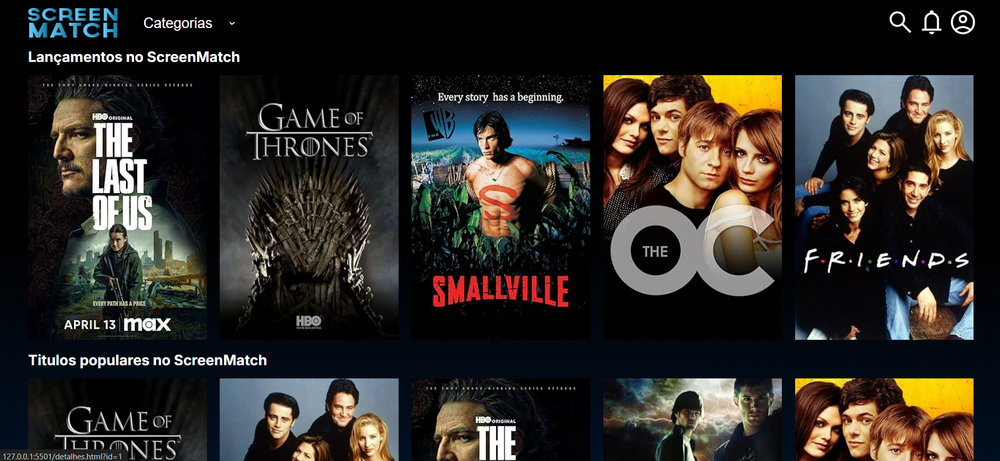

# 🎬 Screenmatch com Web

Projeto full stack desenvolvido durante o programa **Alura + Oracle Next Education**, unindo back-end em Java com Spring Boot e front-end web moderno.

> _"Diferente do pedreiro Bastião, aqui a obra foi finalizada sem bagunça, sem atraso e com documentação!"_ 😄🧱✨

---

## 📌 Sobre o Projeto

O **Screenmatch** é uma aplicação que consome dados de filmes e séries de forma dinâmica, combinando requisições externas com uma camada de serviço organizada e um front-end interativo. Ideal para quem quer ver bons exemplos de integração, organização de código e boas práticas Java na prática!

---

## 🚀 Como rodar o projeto

### 🔧 Back-end (Java + Spring Boot)

1. Navegue até a raiz do projeto
2. Execute com Maven ou IntelliJ:
   ```bash
   mvn spring-boot:run
   ```

## 💻 Front-end
1. 	Acesse a pasta do front:
      
        ```bash
         cd frontend/
        ```
2. 	Instale as dependências e inicie:

        ```bash
         npm install
         npm start
        ```

## 🛠️ Tecnologias Utilizadas
- Java 17
- Spring Boot
- API REST
- Maven
- Java Records e Streams
- HTML/CSS/JavaScript
- Node.js
- VS Code & IntelliJ IDEA

## ✨ Diferenciais
- 🔍 Consumo de API externa
- 🧠 Integração com OpenAI (ChatGPT)
- 💾 Conversão e persistência de dados
- 🎨 Interface web leve e responsiva
- 📄 Código comentado, limpo e organizado

## 📎 Repositório
🔗 github.com/mpbmarcio/screenmatch-com-web
